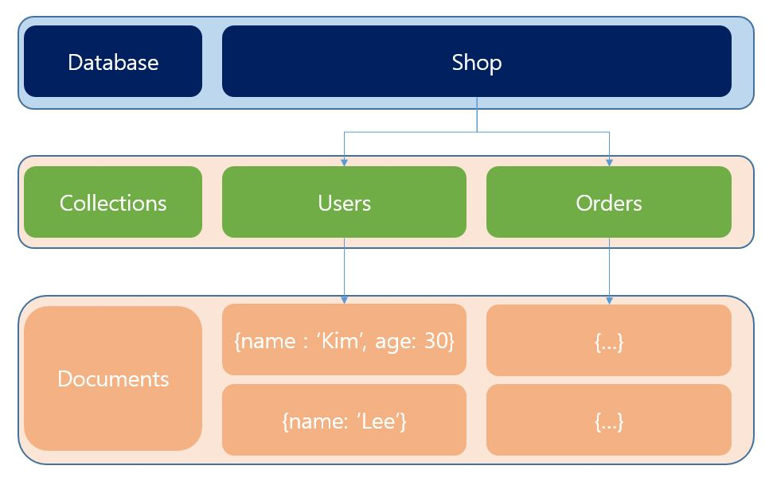

## 몽고 디비란 무엇인가?
<br/>

몽고디비는 데이터베이스의 종류중 하나이다.
`mongo`라는 이름은 `Humongous(거대한)`이라는 단어에서 가져온 이름인데, 그 이름에서 유래했듯이, 데이터의 크기 측면뿐만 아니라 많은 데이터를 저장할 수 있게 설계된 데이터베이스이다.

<br/>
<br/>

### MongoDB의 특징
몽고디비는 기존의 SQL 기반의 RDB(Mysql, Oracle, PostgreSQL 등)가 아닌 [NoSQL](https://ko.wikipedia.org/wiki/NoSQL) 데이터베이스의 한 종류이다.<br/>
그래서 SQL 기반의 RDB와 같이 고정된 구조의 데이터를 저장하는 방식이 아닌 동적으로 JSON형태의 데이터를 저장할 수 있다.



그림을 보면 몽고디비는 여러 Database중의 하나로 Shop이 있고 그 안에 Collections와 각 컬렉션안에 Documents로 구성된다.

<br/>

* Document

하나의 Document는 key-value의 쌍으로 이루어진 `json형식의 데이터로 구성`되어있다.<br/>
여기서 RDB와의 가장 큰 차이점은, RDB는 각 테이블별로 스키마가 있어서 컬럼의 형식이 다 정해져있지만, MongoDB는 같은 컬렉션의 Docuemnt들이라도 `정해진 형식없이` 담고 있는 데이터가 다를 수 있다는 것이다. (`그림의 Users 컬렉션 안에는 2개의 문서가 있는데 2번째 문서에는 age라는 데이터가 존재하지 않는다.`)<br/>
또한, Document는 json형식이기 때문에 중첩된 데이터의 구조를 가질 수 있다.
```json
{
    "name": "Max",
    "age": 29,
    "address": {
       "city": "Munich" 
    },
    "hobbies": [
        {"name":"Cooking"},
        {"name":"Sports"}
    ]
}
```
위의 json 구조처럼 address안에는 또 다른 object 형태의 데이터가, hobbies에는 배열 형태의 데이터로 구성되어 있다. 이를 통해 `RDB의 join이 아닌 데이터 안에 중첩된 데이터를 저장`함으로써 하나의 Document에 담아 저장할 수 있는 장점이 있다.
<br/>
따라서, `MongoDB는 데이터의 유연성을 아주 강력하게 보장`한다는 특징을 갖는다. 데이터의 형식이 바뀔때마다 RDB처럼 테이블의 스키마를 일일히 재구성해주는 작업이 필요없이, 그대로 기존의 Collection에 저장하면 된다.

<br/>
<br/>

### Mysql과 용어 비교

|Mysql|MongoDB|
|---|---|
|Database|Database|
|Table|Collection|
|Row|Document|
|Column|Key/Field|
|Table Join|Embedded Documents|


